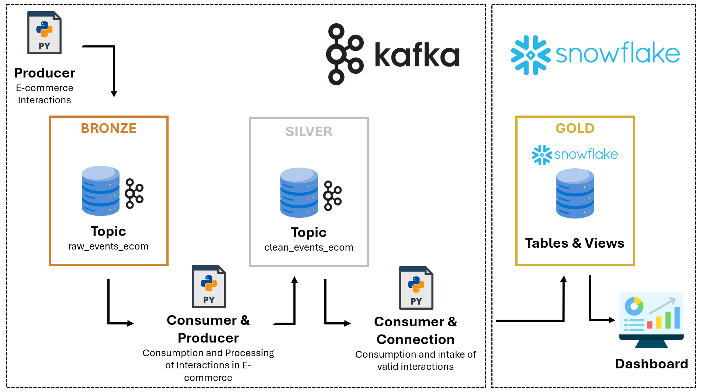
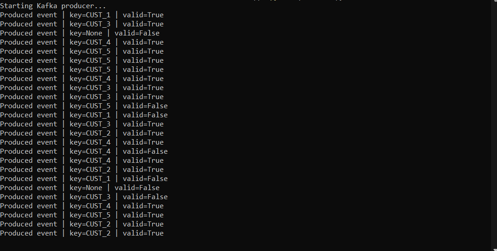
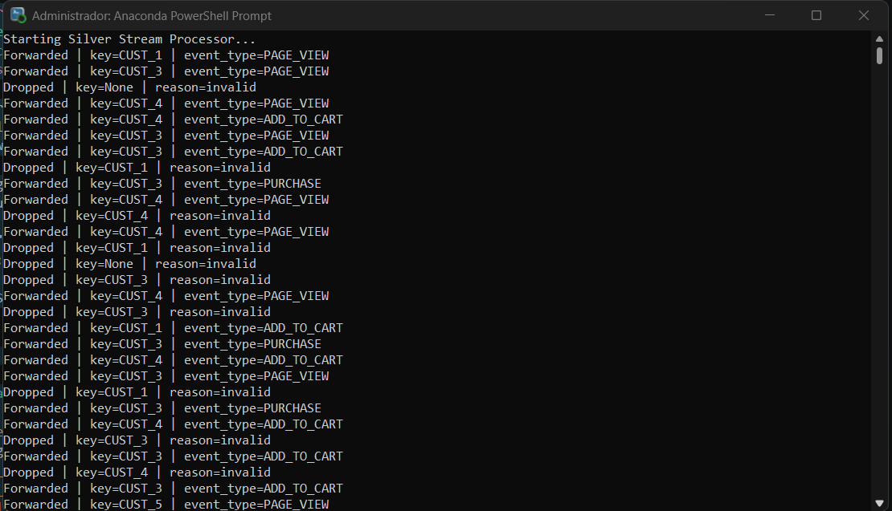
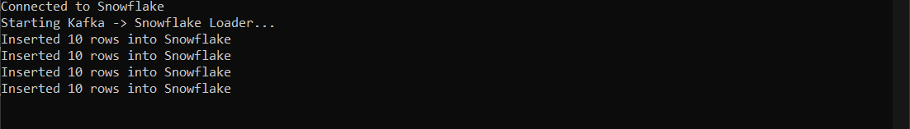

# 🚀 Kafka E-commerce Streaming Pipeline

## 📌 Descripción del Proyecto

Este proyecto implementa un **pipeline de datos en tiempo real** basado en eventos para una plataforma e-commerce, utilizando Apache Kafka como sistema de mensajería distribuida y Snowflake como data warehouse analítico.

El sistema simula interacciones de usuarios (event-driven), las procesa en streaming, filtra datos inválidos y las persiste en Snowflake para su posterior análisis mediante dashboards.

Este enfoque replica una arquitectura moderna de datos basada en el patrón **Medallion Architecture (Bronze → Silver → Gold)**.

---

## 🎯 Objetivos

* Diseñar un pipeline end-to-end de datos en tiempo real
* Comprender el funcionamiento interno de Apache Kafka
* Implementar procesamiento streaming con control de offsets
* Integrar Kafka con Snowflake para analítica
* Construir una capa analítica lista para visualización

---

## 🧰 Stack Tecnológico

| Tecnología   | Uso                                      |
| ------------ | ---------------------------------------- |
| Docker       | Contenerización del entorno              |
| Apache Kafka | Ingesta y streaming de eventos           |
| Python       | Desarrollo de productores y consumidores |
| Snowflake    | Almacenamiento y modelado analítico      |

---

## 🏗️ Arquitectura

### 🔄 Flujo de Datos



---

## ⚙️ Configuración del Entorno

### 1. Levantar servicios con Docker

```bash
docker-compose up -d
```

Esto levanta:

* Kafka Broker + Controller
* Kafka UI (opcional para monitoreo)

---

### 2. Creación de Topics

```bash
./kafka-topics.sh --create --topic raw_events_ecom --bootstrap-server kafka:9092 --partitions 3 --replication-factor 1

./kafka-topics.sh --create --topic clean_events_ecom --bootstrap-server kafka:9092 --partitions 3 --replication-factor 1
```

### 📌 Configuración aplicada

* **Particiones:** 3 (permite paralelismo)
* **Replication factor:** 1 (entorno local con un solo broker)

---

## 🧪 Componentes del Pipeline

### 📤 Producer — `producer.py`

Simula eventos de usuarios en una plataforma e-commerce.

#### Características:

* Generación de eventos aleatorios
* Inclusión de datos inválidos para testing
* Uso de `customer_id` como key para particionamiento

📌 **Importante:**
El uso de `customer_id` como clave garantiza que los eventos del mismo usuario se mantengan en la misma partición (ordering).

#### producer.py:

```
import json
import random
import time
from datetime import datetime, timezone, timedelta
import uuid
from kafka import KafkaProducer

bootstrap_server = "host.docker.internal:29092"
topic_name = "raw_events_ecom"

producer = KafkaProducer(
    bootstrap_servers=bootstrap_server,
    key_serializer=lambda k: k.encode("utf-8") if k else None,
    value_serializer=lambda v: json.dumps(v).encode("utf-8")
)

VALID_EVENT_TYPES = ["PAGE_VIEW", "ADD_TO_CART", "PURCHASE"]
INVALID_EVENT_TYPES = ["CLICK", "VIEW", "PAY"]

def random_timestamp_last_6_days():
    now = datetime.now(timezone.utc)

    random_seconds = random.uniform(0, timedelta(days=6).total_seconds())
    return now - timedelta(seconds=random_seconds)

def generate_event():
    is_invalid = random.random() < 0.25

    customer_id = f"CUST_{random.randint(1,5)}"
    event_type = random.choice(VALID_EVENT_TYPES)
    amount = round(random.uniform(10,500),2)
    currency = "USD"

    invalid_field = None
    if is_invalid:
        invalid_field = random.choice([
            "customer_id",
            "event_type",
            "amount",
            "currency"
        ])
    
    event = {
        "event_id": str(uuid.uuid4()),
        "customer_id": None if invalid_field == "customer_id" else customer_id,
        "event_type": (
            random.choice(INVALID_EVENT_TYPES)
            if invalid_field == "event_type"
            else event_type
        ),
        "amount": (
            random.uniform(-500,-10)
            if invalid_field == "amount"
            else amount
        ),
        "currency": None if invalid_field == "currency" else currency,
        "event_timestamp": random_timestamp_last_6_days().isoformat(),
        "is_valid": not is_invalid,
        "invalid_field": invalid_field
    }

    return event["customer_id"], event

print("Starting Kafka producer...")

while True:
    key, event = generate_event()

    producer.send(
        topic=topic_name,
        key=key,
        value=event
    )

    print(f"Produced event | key={key} | valid={event['is_valid']}")

    time.sleep(1)
```



---

### 🔄 Stream Processor — `stream_processor.py`

Encargado del procesamiento en tiempo real.

#### Funcionalidad:

* Consume eventos desde `raw_events_ecom`
* Aplica validaciones:

  * Campos nulos
  * Montos negativos
* Produce eventos válidos a `clean_events_ecom`

#### Buenas prácticas implementadas:

* ❌ Auto-commit deshabilitado
* ✅ Commit manual post-procesamiento
* ✅ Garantía de no pérdida de datos

#### stream_processor.py:

```
import json
from kafka import KafkaConsumer, KafkaProducer

bootstrap_server = "host.docker.internal:29092"
input_topic = "raw_events_ecom"
output_topic = "clean_events_ecom"
group_id = "silver-stream-processor"

VALID_EVENT_TYPES = ["PAGE_VIEW", "ADD_TO_CART", "PURCHASE"]

consumer = KafkaConsumer(
    input_topic,
    bootstrap_servers = bootstrap_server,
    group_id = group_id,
    auto_offset_reset = "earliest",
    enable_auto_commit = False,
    key_deserializer = lambda k: k.decode("utf-8") if k else None,
    value_deserializer = lambda v: json.loads(v.decode("utf-8"))
)

producer = KafkaProducer(
    bootstrap_servers=bootstrap_server,
    key_serializer=lambda k: k.encode("utf-8") if k else None,
    value_serializer=lambda v: json.dumps(v).encode("utf-8")
)

def is_valid_event(event):

    if not event.get("customer_id"):
        return False
    if event.get("event_type") not in VALID_EVENT_TYPES:
        return False
    if event.get("amount") == None or event.get("amount") <=0:
        return False
    if not event.get("currency"):
        return False
    if event.get("is_valid") == False:
        return False
    return True

print("Starting Silver Stream Processor...")

for message in consumer:
    key = message.key
    event = message.value

    if is_valid_event(event):
        producer.send(
            topic=output_topic,
            key=key,
            value=event
        )
        print(f"Forwarded | key={key} | event_type={event.get("event_type")}")
    else:
        print(f"Dropped | key={key} | reason=invalid")

    consumer.commit()
```



---

### 📥 Snowflake Consumer — `snowflake_consumer.py`

Carga los datos procesados en Snowflake.

#### Características:

* Consumo desde `clean_events_ecom`
* Uso de `snowflake.connector`
* Inserción eficiente con `write_pandas`

#### Optimización:

* Buffer de 10 eventos antes de insertar (micro-batching)

#### snowflake_consumer.py:

```
import json
from kafka import KafkaConsumer
import snowflake.connector
from snowflake.connector.pandas_tools import write_pandas
import pandas as pd

bootstrap_server = "host.docker.internal:29092"
topic_name = "clean_events_ecom"
group_id = "snowflake-loader"

snowflake_config = {
    "user": "your_user",
    "password": "your_password",
    "account": "zg65971.sa-east-1.aws",
    "warehouse": "COMPUTE_WH",
    "database": "KAFKA_ECOMMERCE",
    "schema": "STREAMING_ECOMMERCE"
}

batch_size = 10

consumer = KafkaConsumer(
    topic_name,
    bootstrap_servers = bootstrap_server,
    group_id = group_id,
    enable_auto_commit = False,
    auto_offset_reset = "earliest",
    key_deserializer = lambda k: k.decode("utf-8") if k else None,
    value_deserializer = lambda v: json.loads(v.decode("utf-8"))
)

sf_conn = snowflake.connector.connect(**snowflake_config)

print("Connected to Snowflake")
print("Starting Kafka -> Snowflake Loader...")

buffer = []

def flush_to_snowflake(records):
    df_records = pd.DataFrame(records)
    df_records.columns = [c.upper() for c in df_records.columns]

    success, nchunksn, nrows, _ = write_pandas(
        conn = sf_conn,
        df = df_records,
        table_name = "KAFKA_EVENTS_ECOM_SILVER"
    )

    if not success:
        raise Exception("Snowflake insert failed")

    print(f"Inserted {nrows} rows into Snowflake")

for message in consumer:
    event = message.value
    buffer.append({
        "event_id": event["event_id"],
        "customer_id": event["customer_id"],
        "event_type": event["event_type"],
        "amount": event["amount"],
        "currency": event["currency"],
        "event_timestamp": event["event_timestamp"]
    })

    if len(buffer) >= batch_size:
        try:
            flush_to_snowflake(buffer)
            consumer.commit()
            buffer.clear()
        except Exception as e:
            print(f"Error inserting batch: {e}")
```



---

## ❄️ Modelo de Datos en Snowflake

### 🥈 Tabla (Silver Layer)

* `Kafka_events_ecom_silver`

Contiene eventos limpios y estructurados.

---

### 🥇 Capa Gold (Vistas Analíticas)

#### 📊 `daily_customer_revenue`

* Revenue total por cliente por día

#### 📊 `event_funnel`

* Conteo de eventos por tipo y fecha
* Permite analizar el funnel:

  * View → Add to Cart → Purchase

---

## 📈 Dashboard

> *(Agregar imagen aquí)*

El dashboard permite:

* 📊 Análisis de revenue por cliente
* 📅 Tendencias temporales
* 🔄 Funnel de conversión
* 📈 Actividad de usuarios

---

## 💡 Conceptos Clave Aplicados

Este proyecto permitió profundizar en:

* Arquitectura basada en eventos
* Kafka Topics, Partitions y Offsets
* Consumer Groups
* Control manual de commits
* Procesamiento en streaming
* Integración de sistemas OLTP → OLAP
* Patrón Medallion

---

## ⚠️ Limitaciones del Proyecto

* Single broker (sin alta disponibilidad)
* Validaciones básicas de datos
* No hay manejo de errores avanzado (DLQ)
* No se implementa schema registry

---

## 🚀 Mejoras Futuras

* Implementar **Schema Registry (Avro/Protobuf)**
* Agregar **Dead Letter Queue (DLQ)**
* Orquestación con **Apache Airflow**
* Procesamiento avanzado con **Spark Streaming o Flink**
* Escalamiento a múltiples brokers
* Implementar CI/CD

---

## 📚 Referencias

* YouTube: *Data with Jay*

---

## 👨‍💻 Autor

Proyecto desarrollado como parte del aprendizaje en **Data Engineering** enfocado en arquitecturas modernas de streaming.

---

## ⭐ Nota Final

Este proyecto representa una implementación base pero sólida de un pipeline en tiempo real, alineado con prácticas utilizadas en entornos productivos de datos.

---
